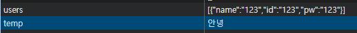

# todolist / shoppinglist 의 script 분할

```html
  <script src="./01_shoppinglist.js" defer></script>
```

defer : html `<script>` 태그에 사용하는 속성 중 하나로, 스크립트파일 다운 방식 제어.

defer 사용시에는 웹 페이지의 HTML 파싱을 중단하지않고 스크립트 로직ㅇ르 다운, 그리고 다운로드 완료 이후에 HTML 문서의 파싱이 끝나는 시점에 스크립트 실행
- html 문서에 명시된 순서대로 실행 보장.

# Todolist 복습
localStorage의 저장 방식
key - value 쌍으로 이루어져있고, value에는 다양한 자료형이 들어갈 수 있습니다.

todolist에는 todos라는 key에 value로 배열이 들어가있고, 배열 내부 요소는 JS 객체 형태로 되어있습니다.

하지만 모든 localStorage의 value가 배열일 필요는 없습니다




autosave -> afterdelay / onFocusChange 


로그인 및 회원가입 기능 구현 목표
HTML CSS 활용 UI 구성
JavaScript 데이터 저장 및 페이지 이동 구현

파일 목록 5개
1. signin.html
2. signup.html
3. style.css  - 공통 규격으로 쓸 수 있게끔 id / class를 지정할 필요가 있습니다.
4. signin.js
5. signup.js

빅데이터_김일_UI구현.zip

요구사항 1.
페이지 구성 로그인 페이지와 회원가입 페이지 두개의 HTML파일 작성
로그인페이지에서 "회원가입" 링크 클릭시 회원가입 페이지로 이동
회원가입 페이지에서 "로그인" 링크를 클릭하면 로그인페이지로 이동
window.location.href

요구사항 2.
CSS 레이아웃 Flexbox 를 사용하여 로그인 및 회원가입 폼을 화면 중앙에 배치
입력 필드와 버튼의 간격은 Flexbox를 활용하여 균등하게 설정한다.
로그인페이지와 회원가입 페이지의 스타일은 통일감을 유지한다.